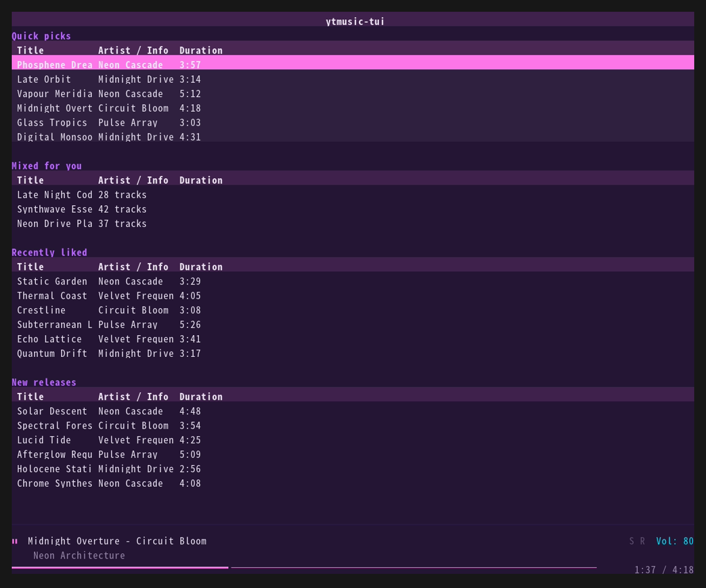
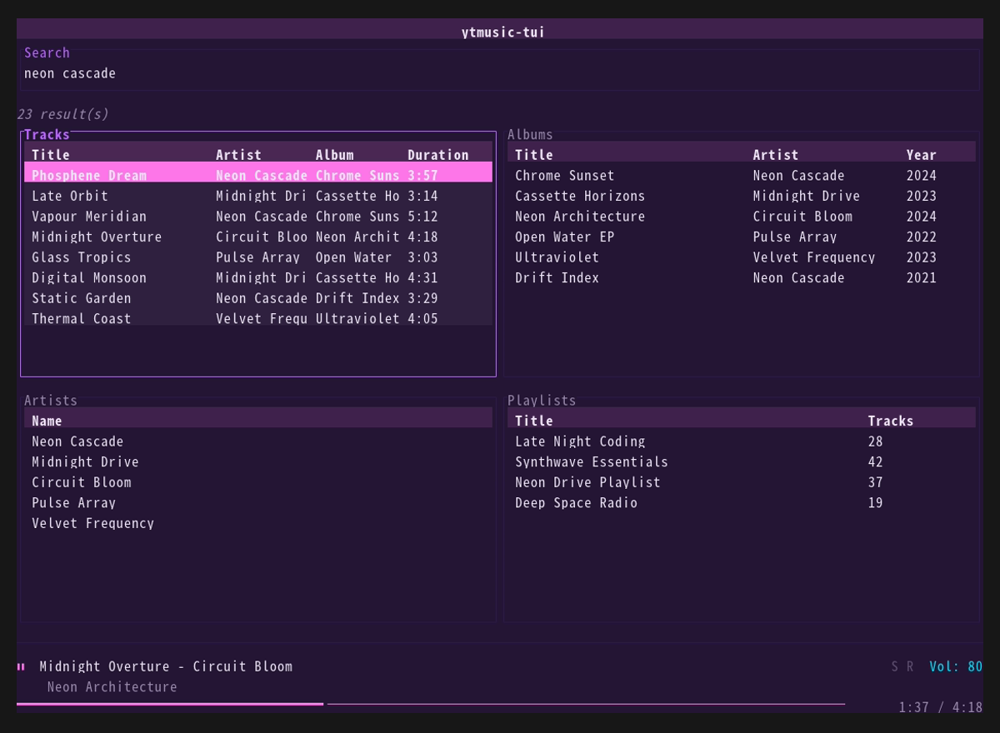
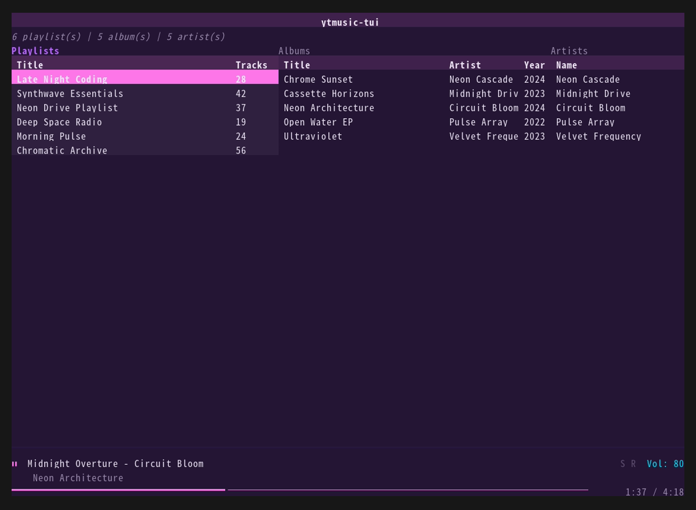
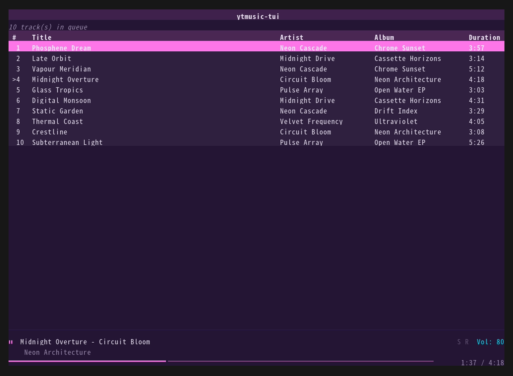
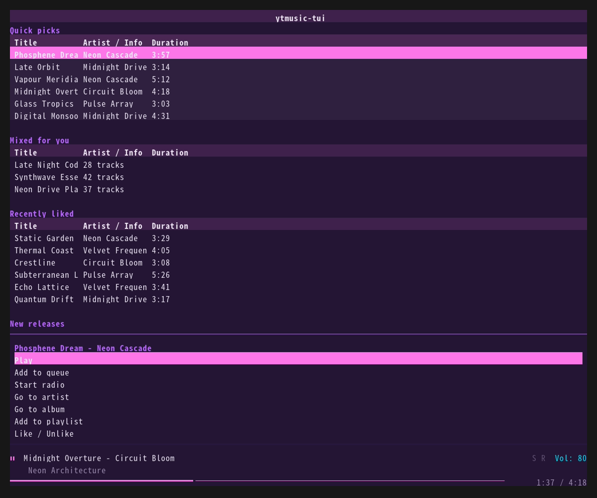
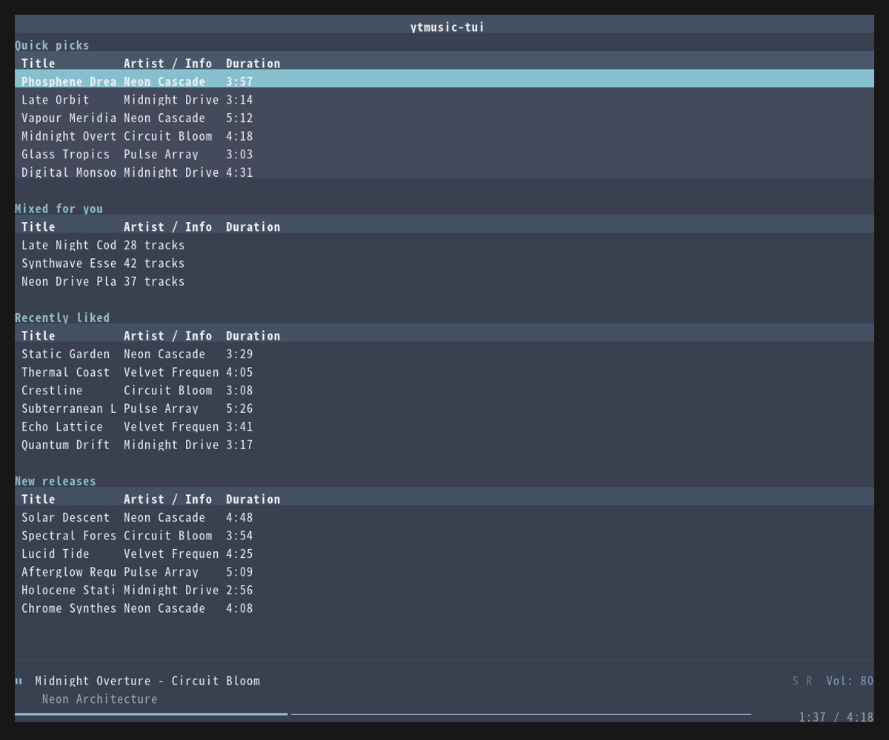
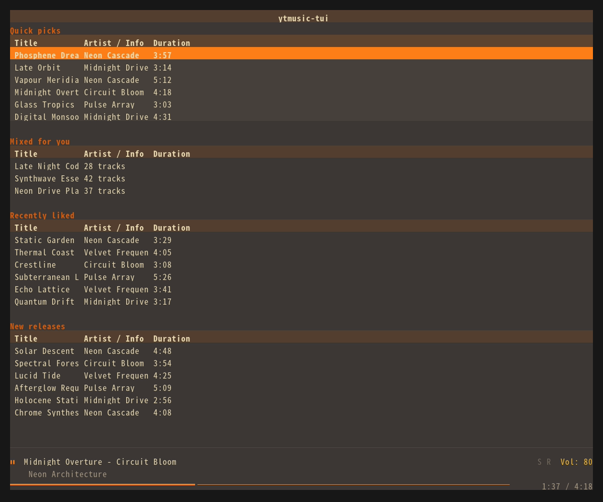
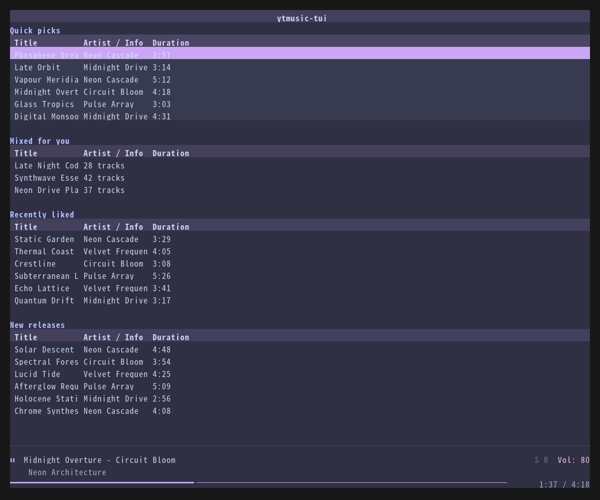

# ytmusic-tui

A terminal music player for YouTube Music, built for keyboard-driven workflows.

> **Status:** Beta. Playback, search, library, history, lyrics, radio, likes,
> MPRIS, theming, and custom keymaps are functional.

> **Maintenance:** This is a hobby project, developed in bursts. Once it does
> what I need, it may go quiet for stretches — issues and PRs are still
> welcome, and reviews are best-effort.




<sub>Home view, synthwave theme. All images are generated from a built-in demo
dataset (`screenshots/generate.sh`) — no real account data.</sub>

## What is this?

**ytmusic-tui** brings your YouTube Music library to the terminal — playlists,
search, recommendations, and queue management with vim-style keybindings.
Inspired by [spotify_player](https://github.com/aome510/spotify_player),
designed for tiling WM setups.

## Features

- **Multi-category search** — songs, albums, artists, and playlists in a 4-pane
  grid, with `#songs:`-style category filters
- **Home view** with personalized recommendations
- **Playlist browsing** — drill into playlists, queue from any track
- **3-pane library** — Playlists, Albums, and Artists tabs (Tab to cycle)
- **Album and Artist views** — dedicated detail pages
- **Queue management** with shuffle and repeat
- **Radio** — start a YouTube Music radio from any track (`R`)
- **Likes** — like/unlike tracks without leaving the terminal (`f`)
- **Recently played** — your listening history as a page (`H`)
- **Lyrics page** (`L` key)
- **MPRIS2 integration** — playerctl / waybar / KDE Connect control and metadata
- **Navigation history** — Esc goes back through visited pages
- **Action popup** (`.` key) — context actions for the selected track/playlist/album
- **Filter bar** (`/` key) — live-filter the current list without leaving the view
- **Custom keymaps** via `~/.config/ytmusic-tui/keymap.toml`, including two-key
  sequences (`g s` for search page)
- **Responsive layout** — adapts orientation based on terminal size
- **mpv-based audio backend** (plays YouTube URLs directly via ytdl-hook)
- **Vim-style keybindings** (spotify_player-compatible defaults, fully remappable)
- **TOML configuration** (`~/.config/ytmusic-tui/config.toml`)
- **Theme system** with four built-in palettes: synthwave, nord, gruvbox, catppuccin
- **Theme switcher** (`T` key) — change themes on the fly
- **Player bar** with progress, volume, and now-playing info

## Screenshots

| | |
|---|---|
|  |  |
| *Search — songs, albums, artists, playlists* | *Library — playlists, albums, artists* |
|  |  |
| *Queue with current-track marker* | *Action popup (`.`) — context actions* |

The player bar (now playing, progress, shuffle/repeat, volume) is visible at
the bottom of every view.

## Requirements

- [libmpv2](https://mpv.io/) — the shared library `libmpv.so.2` must be on the
  system library path.
  - Arch Linux: `sudo pacman -S mpv` (includes `libmpv.so.2`)
  - Debian/Ubuntu: `sudo apt install libmpv2`
- [yt-dlp](https://github.com/yt-dlp/yt-dlp) — mpv's ytdl-hook uses it to
  resolve YouTube stream URLs. Keep it up to date: YouTube rotates its
  JavaScript challenge periodically, and an outdated yt-dlp silently fails to
  play anything (keep at least version 2026.6.9 or newer).

## Installation

```bash
# Install system dependencies (Arch Linux)
sudo pacman -S mpv yt-dlp

# Build from source
git clone https://github.com/WakaTaira/ytmusic-tui.git
cd ytmusic-tui
cargo build --release

# The binary is at:
#   target/release/ytmusic-tui
# Install it wherever you like, e.g.:
cp target/release/ytmusic-tui ~/.local/bin/
```

### Authenticate with YouTube Music

Authentication is cookie-based. You need a `browser.json` file in ytmusicapi
format at `~/.config/ytmusic-tui/browser.json`. There are two ways to create it:

**Option A — ytmusicapi CLI (requires Python)**

```bash
pip install ytmusicapi
ytmusicapi browser --file ~/.config/ytmusic-tui/browser.json
```

The command guides you through copying the request headers from
music.youtube.com in your browser's DevTools.

**Option B — manual header paste**

1. Open [music.youtube.com](https://music.youtube.com) and sign in.
2. Open DevTools → Network → reload the page → pick any `browse` request.
3. Right-click the request → Copy → Copy as cURL.
4. Run `ytmusicapi browser` and paste the headers when prompted.

Cookies expire after a while. If your library suddenly shows up empty, run
`ytmusicapi browser` again (or re-export your headers).

> **Note:** OAuth is broken upstream (ytmusicapi issue #813). Browser cookie
> auth is the only working method.

## Usage

```bash
ytmusic-tui
```

If a `browser.json` is missing or invalid, the player still starts and shows a
session warning on the status line. Use the auth commands above to create one,
then restart.

## Keybindings

| Key                            | Action                             |
|--------------------------------|------------------------------------|
| `j` / `k` (or `↓` / `↑`)      | Navigate rows down / up            |
| `Enter`                        | Play / Select                      |
| `Space`                        | Play / Pause                       |
| `n` / `p`                      | Next / Previous                    |
| `>` / `<`                      | Seek +5 s / -5 s                   |
| `^`                            | Seek to start                      |
| `_`                            | Mute toggle                        |
| `b`                            | Cycle audio quality (low/normal/high) |
| `f`                            | Like / unlike current track        |
| `R`                            | Start radio from current track     |
| `H`                            | Recently played (history)          |
| `/`                            | Filter current list                |
| `.`                            | Action popup (context menu)        |
| `T`                            | Theme switcher                     |
| `Tab`                          | Cycle panes (search / library)     |
| `g`                            | Home                               |
| `l`                            | Library                            |
| `q`                            | Queue view                         |
| `L`                            | Lyrics                             |
| `a`                            | Go to current track's artist       |
| `A`                            | Go to current track's album        |
| `s`                            | Shuffle toggle                     |
| `r`                            | Repeat toggle                      |
| `+` / `-`                      | Volume up / down                   |
| `d`                            | Remove from queue                  |
| `Esc`                          | Back (navigation history)          |
| `Q`                            | Quit                               |

All keybindings can be remapped via `keymap.toml` (see Configuration).

### Unbound actions

Some actions ship without a default key but can be assigned in `keymap.toml`:

- **`search_page`** — jump to the search view and focus its input box. The
  spotify_player default for this is the two-key sequence `g s`, which this
  binary supports natively (unlike the Python version). It ships with `g s`
  pre-wired; you can rebind it to a single key if you prefer:

  ```toml
  [keybinds]
  search_page = "ctrl+s"
  ```

### Keymap behavior notes

- **Typo'd action names** are silently ignored (forward compatibility: new
  action names added in future versions will not break existing keymap files).
- **Typo'd key strings** (unparseable key syntax) are surfaced as a one-line
  warning on the status line once at startup, then silently dropped. Fix the
  typo and restart to clear the warning.

## Configuration

### config.toml

```toml
# ~/.config/ytmusic-tui/config.toml

[auth]
browser_auth_path = "~/.config/ytmusic-tui/browser.json"

[player]
volume = 80
audio_quality = "high"  # low / normal / high

[ui]
theme = "synthwave"  # synthwave / nord / gruvbox / catppuccin
```

### keymap.toml

Override any keybinding by creating or editing the user keymap file:

```bash
# Copy the shipped defaults as a starting point
cp config/default_keymap.toml ~/.config/ytmusic-tui/keymap.toml
# (The config/ directory is at the repo root alongside the Cargo workspace)
```

```toml
# ~/.config/ytmusic-tui/keymap.toml
# List only the bindings you want to change.

[keybinds]
toggle_pause   = "space"
next_track     = "n"
previous_track = "p"
search_page    = "g s"    # two-key sequence; supported natively
# Key names follow the Python/Textual convention (see default_keymap.toml for all actions)
```

The config format is identical to the Python version's `keymap.toml`, so
existing files work unchanged.

### Themes

| Theme      | Description                           |
|------------|---------------------------------------|
| synthwave  | Magenta/cyan/purple on dark (default) |
| nord       | Blue/teal accent on dark gray         |
| gruvbox    | Orange/yellow on dark brown           |
| catppuccin | Lavender/pink on dark                 |

| | |
|---|---|
|  |  |
| *synthwave* | *nord* |
|  |  |
| *gruvbox* | *catppuccin* |

Screenshots are regenerated with `./screenshots/generate.sh` (requires
[vhs](https://github.com/charmbracelet/vhs); on Arch: `sudo pacman -S vhs ttyd`).
The script drives the binary in a built-in demo mode (`YTMUSIC_TUI_DEMO=1`)
with a fictional catalog, so output is deterministic and contains no account
data.

## MPRIS2 / waybar / playerctl

The player registers itself on the session D-Bus as
`org.mpris.MediaPlayer2.ytmusic-tui`. Commands via `playerctl` just work:

```bash
playerctl --player ytmusic-tui play-pause
playerctl --player ytmusic-tui next
playerctl --player ytmusic-tui metadata
```

**waybar position counter freezes.** This is a waybar client-side behavior, not
a player bug. The MPRIS spec says compliant players must not spam the `Position`
property via `PropertiesChanged` signals — ytmusic-tui follows the spec.
waybar's mpris module renders event-driven by default and so does not
auto-refresh position. Fix this by adding `"interval": 1` to the mpris module
in your waybar config:

```jsonc
// ~/.config/waybar/config.jsonc
"mpris": {
    "interval": 1,
    ...
}
```

## Architecture

```
.
├── ytmusic-api/         # Library crate: InnerTube transport + auth + domain models
│   src/
│   ├── lib.rs           # Public API re-exports (InnerTubeClient, BrowserAuth, Track, ...)
│   ├── auth.rs          # Browser-header auth + SAPISIDHASH generation
│   ├── client.rs        # InnerTubeClient: HTTP requests, session canary
│   ├── classify.rs      # classify_api_error: error taxonomy (auth / not-found / network / ...)
│   ├── endpoints/       # One file per API surface (home, search, album, artist, ...)
│   ├── models.rs        # Domain types: Track, AlbumInfo, ArtistInfo, PlaylistInfo, ...
│   └── parse.rs / nav.rs / context.rs  # InnerTube response navigation helpers
│
└── ytmusic-tui/         # Binary + lib crate: UI, player, queue, keymap, config
    src/
    ├── main.rs          # Binary entry: config loading, terminal setup, render/input loop
    ├── lib.rs           # Crate module root
    ├── app/mod.rs       # AppCommand/AppEvent channels, spawn_runtime (tokio + forwarder threads)
    ├── player.rs        # libmpv-rs wrapper: play, seek, volume, mute, PlayerEvent stream
    ├── queue.rs         # QueueManager: shuffle, repeat, track list
    ├── config.rs        # TOML config loading, theme definitions, keymap loading
    ├── keymap.rs        # Keymap dispatcher: key→Action, two-key sequence support
    ├── navigation.rs    # NavigationManager: page-stack history (Esc goes back)
    ├── layout.rs        # Responsive orientation detection (aspect ratio 2.3 threshold)
    ├── formatting.rs    # Duration formatting helpers
    ├── mpris/           # MPRIS2 server (mpris-server 0.10 on the tokio runtime)
    └── views/           # One module per page + popup + filter bar (ratatui widgets)
```

The binary runs two extra threads beyond the main render thread:

1. **Runtime thread** — a `std::thread` hosting a `tokio::Runtime`. Owns the
   `InnerTubeClient`, `QueueManager`, `Player`, and (M6) the MPRIS server. All
   async API calls and playback commands land here via a `tokio::sync::mpsc`
   unbounded channel.
2. **Forwarder thread** — a `std::thread` that blocks on mpv's `PlayerEvent`
   receiver and re-publishes each event as an `AppEvent` onto the UI's
   `std::sync::mpsc` channel. A second sink will be added for MPRIS metadata
   updates without changing the forwarder's shape (YAGNI until a second
   consumer exists).

The main thread's ratatui render loop is fully synchronous and never blocks.

## Contributing

See [CONTRIBUTING.md](CONTRIBUTING.md) for development setup and guidelines.

## License

[MIT](LICENSE)
