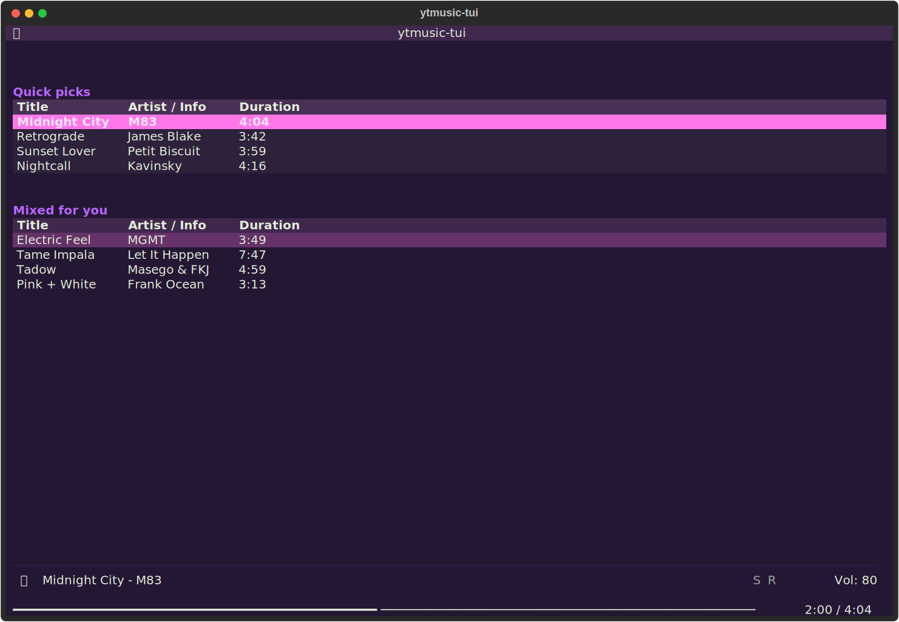
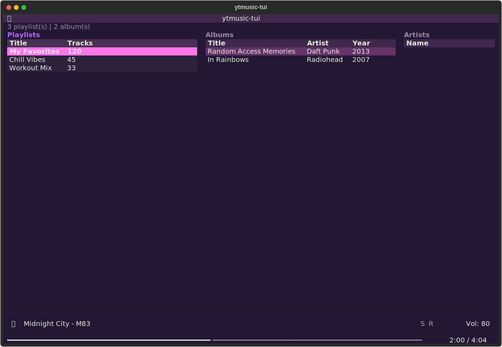
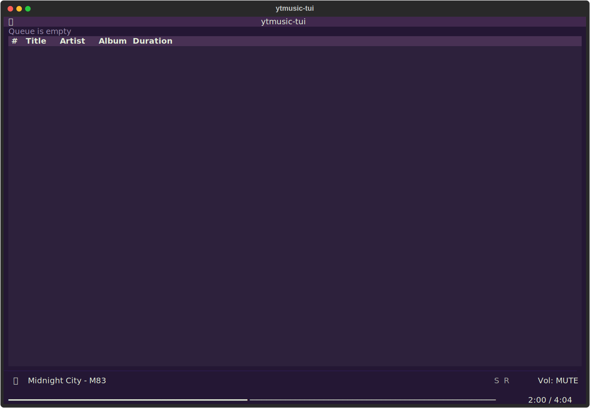

# ytmusic-tui

A terminal music player for YouTube Music, built for keyboard-driven workflows.

> **Status:** Beta. Playback, search, library, history, lyrics, radio, likes, MPRIS, theming, and custom keymaps are functional. A Rust rewrite is planned once the Python version stabilizes.



<details>
<summary>More screenshots</summary>




</details>

## What is this?

**ytmusic-tui** brings your YouTube Music library to the terminal -- playlists, search, recommendations, and queue management with vim-style keybindings. Inspired by [spotify_player](https://github.com/aome510/spotify_player), designed for tiling WM setups.

## Features

- **Multi-category search** -- songs, albums, artists, and playlists in a 4-pane grid, with `#songs:`-style category filters
- **Home view** with personalized recommendations
- **Playlist browsing** -- drill into playlists, queue from any track
- **3-pane library** -- Playlists, Albums, and Artists tabs (Tab to cycle)
- **Album and Artist views** -- dedicated detail pages for albums and artists
- **Queue management** with shuffle and repeat
- **Radio** -- start a YouTube Music radio from any track (`R`)
- **Likes** -- like/unlike tracks without leaving the terminal (`f`)
- **Recently played** -- your listening history as a page (`H`)
- **Lyrics page** (`L` key)
- **MPRIS2 integration** -- playerctl / waybar / KDE Connect control and metadata
- **Navigation history** -- Esc goes back through visited pages
- **Action popup** (`.` key) -- context actions for the selected track/playlist/album
- **Filter bar** (`/` key) -- live-filter the current list without leaving the view
- **Custom keymaps** via `~/.config/ytmusic-tui/keymap.toml`
- **Responsive layout** -- adapts orientation based on terminal size
- **mpv-based audio backend** (plays YouTube URLs directly via ytdl-hook)
- **Vim-style keybindings** (spotify_player-compatible defaults, fully remappable)
- **TOML configuration** (`~/.config/ytmusic-tui/config.toml`)
- **Theme system** with four built-in palettes: synthwave, nord, gruvbox, catppuccin
- **Theme switcher** (`T` key) -- change themes on the fly
- **Player bar** with progress, volume, and now-playing info

## Requirements

- Python 3.12+
- [mpv](https://mpv.io/)
- [yt-dlp](https://github.com/yt-dlp/yt-dlp)

## Installation

```bash
# Install system dependencies (Arch Linux)
sudo pacman -S mpv yt-dlp python

# Install ytmusic-tui
pip install -e ".[dev]"

# Authenticate with YouTube Music (interactive, guides you through
# copying request headers from music.youtube.com)
ytmusic-tui auth
```

Cookies expire after a while; if your library suddenly shows up empty,
just run `ytmusic-tui auth` again.

## Usage

```bash
ytmusic-tui
```

## Keybindings

| Key       | Action                             |
|-----------|------------------------------------|
| `j` / `k` (or `↓` / `↑`) | Navigate rows down/up |
| `Enter`   | Play / Select                      |
| `Space`   | Play / Pause                       |
| `n` / `p` | Next / Previous                    |
| `>` / `<` | Seek +5s / -5s                     |
| `^`       | Seek to start                      |
| `_`       | Mute toggle                        |
| `f`       | Like / unlike current track        |
| `R`       | Start radio from current track     |
| `H`       | Recently played (history)          |
| `/`       | Filter current list                |
| `.`       | Action popup (context menu)        |
| `T`       | Theme switcher                     |
| `Tab`     | Cycle panes (search / library)     |
| `g`       | Home                               |
| `l`       | Library                            |
| `q`       | Queue view                         |
| `a`       | Go to current track's artist       |
| `A`       | Go to current track's album        |
| `s`       | Shuffle toggle                     |
| `r`       | Repeat toggle                      |
| `+` / `-` | Volume up/down                    |
| `d`       | Remove from queue                  |
| `Esc`     | Back (navigation history)          |
| `Q`       | Quit                               |
| `1`-`7`   | Direct view switch                 |

All keybindings can be remapped via `keymap.toml` (see Configuration).

**Unbound actions.** Some actions ship without a default key but can be
bound in `keymap.toml`. `search_page` jumps to the search page and focuses
its input -- the spotify_player default for this is the two-key sequence
`g s`, which the terminal binding layer cannot express, so it is left
unbound. Assign it a single key if you want it:

```toml
[keybinds]
search_page = "ctrl+s"  # go to the search page and focus its input
```

## Configuration

### config.toml

```toml
# ~/.config/ytmusic-tui/config.toml

[auth]
browser_auth_path = "~/.config/ytmusic-tui/browser.json"

[player]
volume = 80
audio_quality = "high"  # low / normal / high

[ui]
theme = "synthwave"  # synthwave / nord / gruvbox / catppuccin
```

### keymap.toml

Override any keybinding by copying the default keymap and editing it:

```bash
cp config/default_keymap.toml ~/.config/ytmusic-tui/keymap.toml
```

```toml
# ~/.config/ytmusic-tui/keymap.toml
# Only list the bindings you want to change.

[keybinds]
toggle_pause = "space"
next_track = "n"
previous_track = "p"
open_action_popup = "full_stop"
open_theme_popup = "T"
# Key names follow Textual conventions (see default_keymap.toml for all actions)
```

### Themes

| Theme       | Description                          |
|-------------|--------------------------------------|
| synthwave   | Magenta/cyan/purple on dark (default)|
| nord        | Blue/teal accent on dark gray        |
| gruvbox     | Orange/yellow on dark brown          |
| catppuccin  | Lavender/pink on dark                |

## Architecture

```
src/ytmusic_tui/
  app.py          # Application skeleton: bindings, keymap, compose, navigation
  actions.py      # Action handler mixins (playback / browse / popup follow-ups)
  api.py          # YouTube Music API wrapper (ytmusicapi)
  auth.py         # Auth validation, error classification, `ytmusic-tui auth` CLI
  player.py       # mpv playback controller
  queue.py        # Playback queue with shuffle/repeat
  config.py       # TOML config loading, theme system, keymap loader
  navigation.py   # Page-stack navigation history (back with Esc)
  layout.py       # Responsive orientation detection
  formatting.py   # Shared formatting helpers
  mpris.py        # MPRIS2 media controls (Linux)
  views/
    home.py       # Recommendations with interactive section tables
    search.py     # 4-pane multi-category search with #category: filters
    library.py    # 3-pane library (Playlists/Albums/Artists)
    playlist.py   # Playlist browser (list -> tracks drill-down)
    album.py      # Album detail view
    artist.py     # Artist detail view
    history.py    # Recently played
    lyrics.py     # Lyrics page
    queue.py      # Queue display with remove support
    player.py     # Player bar (now playing, progress, volume)
    popup.py      # Action / theme / playlist-picker popups
    filter_bar.py # Live filter bar for DataTable views
    guards.py     # Teardown-safety for worker UI callbacks
```

## Contributing

See [CONTRIBUTING.md](CONTRIBUTING.md) for development setup and guidelines.

## License

[MIT](LICENSE)
